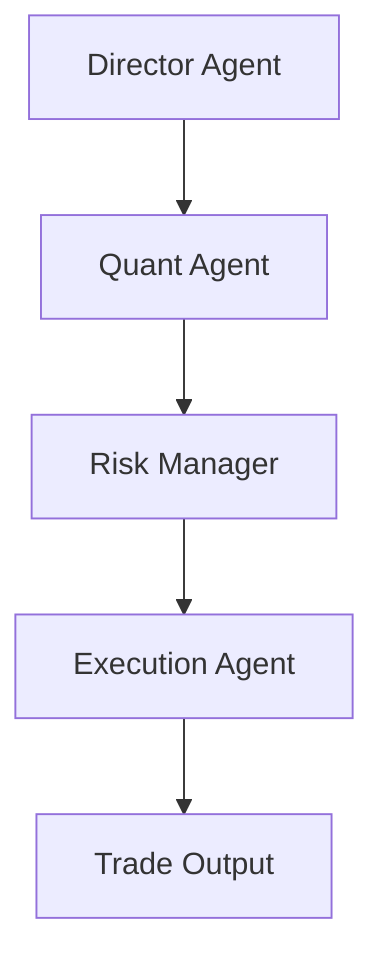

# AutoHedge 🚀

[](https://discord.gg/agora-999382051935506503) [](https://www.youtube.com/@kyegomez3242) [](https://www.linkedin.com/in/kye-g-38759a207/) [](https://x.com/kyegomezb)


[](https://badge.fury.io/py/autohedge)
[](https://opensource.org/licenses/MIT)
[](https://www.python.org/downloads/)
[](https://autohedge.readthedocs.io)
[](https://github.com/psf/black)

AutoHedge is an enterprise-grade autonomous trading system powered by swarm intelligence and advanced AI agents. It provides a comprehensive framework for automated market analysis, risk management, and trade execution.

## 🌟 Features

- **Multi-Agent Architecture**: Leverages specialized AI agents for different aspects of trading
  - Director Agent for strategy and thesis generation
  - Quant Agent for technical analysis
  - Risk Management Agent for position sizing and risk assessment
  - Execution Agent for trade implementation

- **Real-Time Market Analysis**: Integrates with market data providers for live analysis
- **Risk-First Approach**: Built-in risk management and position sizing
- **Structured Output**: JSON-formatted trade recommendations and analysis
- **Comprehensive Logging**: Detailed logging system for trade tracking and debugging
- **Extensible Framework**: Easy to customize and extend with new capabilities

## 📋 Requirements

- Python 3.8+
- `swarms` package
- `tickr-agent`
- Additional dependencies listed in `requirements.txt`

## 🚀 Quick Start

### Installation

```bash
pip install -U autohedge
```

### Environment Variables

```bash
OPENAI_API_KEY=""
WORKSPACE_DIR="agent_workspace"
```

### Basic Usage

```python
# Example usage
from autohedge import AutomatedTradingSystem

# Define the stocks to analyze
stocks = ["NVDA"]

# Initialize the trading system with the specified stocks
trading_system = AutomatedTradingSystem(stocks)

# Define the task for the trading cycle
task = "Let's analyze nvidia to see if we should buy it, we have 50k$ in allocation"

# Run the trading cycle and print the results
print(trading_system.run_trading_cycle(task=task))

```

## 🏗️ Architecture

AutoHedge uses a multi-agent architecture where each agent specializes in a specific aspect of the trading process:



### Agent Roles

1. **Director Agent**
   - Generates trading theses
   - Coordinates overall strategy
   - Analyzes market conditions

2. **Quant Agent**
   - Performs technical analysis
   - Evaluates statistical patterns
   - Calculates probability scores

3. **Risk Manager**
   - Assesses trade risks
   - Determines position sizing
   - Sets risk parameters

4. **Execution Agent**
   - Generates trade orders
   - Sets entry/exit points
   - Manages order execution

## 📊 Output Format

AutoHedge generates structured output using Pydantic models:

```python
class AutoHedgeOutput(BaseModel):
    id: str                         # Unique identifier
    name: Optional[str]             # Strategy name
    description: Optional[str]      # Strategy description
    stocks: Optional[List[str]]     # List of stocks
    task: Optional[str]             # Analysis task
    thesis: Optional[str]           # Trading thesis
    risk_assessment: Optional[str]  # Risk analysis
    order: Optional[Dict]           # Trade order details
    timestamp: str                  # Timestamp
    current_stock: str              # Current stock being analyzed
```

## 🔧 Configuration

AutoHedge can be configured through environment variables or initialization parameters:

```python
trading_system = AutomatedTradingSystem(
    name="CustomStrategy",
    description="My Trading Strategy",
    stocks=["NVDA", "AAPL"],
    output_dir="custom_outputs"
)
```


## 📝 Logging

AutoHedge uses the `loguru` library for comprehensive logging:

```python
logger.add(
    "trading_system_{time}.log",
    rotation="500 MB",
    retention="10 days",
    level="INFO",
    format="{time:YYYY-MM-DD at HH:mm:ss} | {level} | {message}"
)
```

## 🔍 Advanced Usage

### Custom Agent Configuration

```python
from autohedge import TradingDirector, QuantAnalyst, RiskManager

# Custom director configuration
director = TradingDirector(
    stocks=["NVDA", "AAPL"],
    output_dir="custom_outputs"
)

# Custom analysis
analysis = director.generate_thesis(
    task="Generate comprehensive analysis",
    stock="NVDA"
)
```

### Risk Management

```python
from autohedge import RiskManager

risk_manager = RiskManager()
assessment = risk_manager.assess_risk(
    stock="NVDA",
    thesis=thesis,
    quant_analysis=analysis
)
```

## 🤝 Contributing

We welcome contributions! Please see our [Contributing Guidelines](CONTRIBUTING.md) for details.

1. Fork the repository
2. Create your feature branch (`git checkout -b feature/AmazingFeature`)
3. Commit your changes (`git commit -m 'Add some AmazingFeature'`)
4. Push to the branch (`git push origin feature/AmazingFeature`)
5. Open a Pull Request

## 📜 License

This project is licensed under the MIT License - see the [LICENSE](LICENSE) file for details.

## 🙏 Acknowledgments

- [Swarms](https://swarms.ai) for the AI agent framework
- [Tickr Agent](https://github.com/The-Swarm-Corporation/tickr-agent) for market data integration

## 📞 Support

- Documentation: [https://autohedge.readthedocs.io](https://autohedge.readthedocs.io)
- Issue Tracker: [GitHub Issues](https://github.com/The-Swarm-Corporation/AutoHedge/issues)
- Discord: [Join our community](https://discord.gg/autohedge)

## 🚨 Disclaimer

AutoHedge is provided for informational purposes only. It is not financial advice and should not be used as a sole basis for making investment decisions. Always conduct your own research and consider seeking professional financial advice.

---
Created with ❤️ by [The Swarm Corporation](https://github.com/The-Swarm-Corporation)